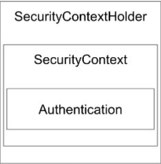
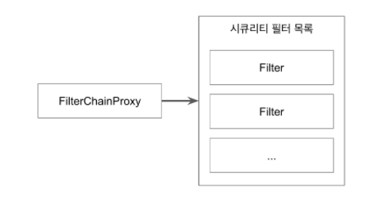
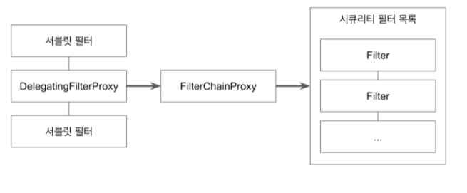

## 폼 인증 예제 살펴보기
- 이 애플리케이션에는 다음과 같은 총 4개의 뷰가 있습니다.
- 홈 페이지
    * /
    * 인증된 사용자도 접근할 수 있으며 인증하지 않은 사용자도 접근할 수 있습니다.
    * 인증된 사용자가 로그인 한 경우에는 이름을 출력할 것.
- 정보
    * /info
    * 이 페이지는 인증을 하지 않고도 접근할 수 있으며, 인증을 한 사용자도 접근할 수 있습니다.
- 대시보드
    * /dashboard
    * 이 페이지는 반드시 로그인 한 사용자만 접근할 수 있습니다.
    * 인증하지 않은 사용자가 접근할 시 로그인 페이지로 이동합니다.
- 어드민
    * /admin
    * 이 페이지는 반드시 ADMIN 권한을 가진 사용자만 접근할 수 있습니다.
    * 인증하지 않은 사용자가 접근할 시 로그인 페이지로 이동합니다.
    * 인증은 거쳤으나, 권한이 충분하지 않은 경우 에러 메시지를 출력합니다.
- 첫 페이지 (/) 에 로그인 하지 않고 접속하면 보이는 메시지 확인.
- 로그인 하지 않고 볼 수 있는 페이지 (/info)에 접근.
- 로그인 해야만 볼 수 있는 페이지 (/dashboard)에 접속할 때 로그인 페이지로 이동.
- 로그인 한 뒤에 가려던 페이지 (/dashboard)로 이동.
- ADMIN 권한이 있는 유저만 접근 가능한 URL (/amdin)로 이동하려는 경우에 보이는 화면
- 로그아웃 (/logout) 하는 경우에 보이는 화면
- ADMIN으로 로그인 한 뒤 (/admin) 접근시 보이는 화면

## 스프링 웹 프로젝트 만들기
- 스프링 부트와 타임리프(Thymeleaf)를 사용해서 간단한 웹 애플리케이션 만들기
    * https://start.spring.io
    * web-start와 thymeleaf 추가
    * /, /info, /dashboard, /admin 페이지와 핸들러 만들기
- 타임리프
    * xmlns:th=”http://www.thymeleaf.org” 네임스페이스를 html 태그에 추가.
    * th:text=”${message}” 사용해서 Model에 들어있는 값 출력 가능.
- 현재 문제
    * 로그인 할 방법이 없음
    * 현재 사용자를 알아낼 방법이 없음

## 스프링 시큐리티 연동
- 스프링 시큐리티 의존성 추가하기
  * 스프링 부트 도움 받아 추가하기
    * 스타터(Starter) 사용
    * 버전 생략 - 스프링 부트의 의존성 관리 기능 사용

  ```xml
  <dependency>
      <groupId>org.springframework.boot</groupId>
      <artifactId>spring-boot-starter-security</artifactId>
  </dependency>
  ```
  
- 스프링 시큐리티 의존성을 추가하고 나면
  * 모든 요청은 인증을 필요로 합니다.
  * 기본 유저가 생성됩니다.
    * Username: user
    * Password: 콘솔에 출력된 문자열 확인

  ```dash
  2022-02-17 21:20:27.533  INFO 69764 --- [           main] .s.s.UserDetailsServiceAutoConfiguration : 
  
  Using generated security password: c16c13c2-8ae3-4801-916b-e5319e624bf2
  ```
  
- 해결된 문제
  * 인증을 할 수 있다.
  * 현재 사용자 정보를 알 수 있다.
- 새로운 문제
  * 인증없이 접근 가능한 URL을 설정하고 싶다.
  * 이 애플리케이션을 사용할 수 있는 유저 계정이 그럼 하나 뿐인가?
  * 비밀번호가 로그에 남는다고?

## 스프링 시큐리티 설정하기
- 스프링 웹 시큐리티 설정 추가

```java
@Configuration
@EnableWebSecurity
public class SecurityConfig extends WebSecurityConfigurerAdapter {

    @Override
    protected void configure(HttpSecurity http) throws Exception {
        http
                .authorizeRequests()
                .mvcMatchers("/", "/info").permitAll()
                .mvcMatchers("/admin").hasRole("ADMIN")
                .anyRequest().authenticated()
                .and()
                .formLogin()
                .and()
                .httpBasic();
    }
}
```

- 해결한 문제
  * 요청 URL별 인증 설정
- 남아있는 문제
  * 여전히 계정은 하나 뿐. 
  * ADMIN 계정도 없음.
  * 비밀번호도 여전히 로그에 남는다.

## 스프링 시큐리티 커스터마이징: 인메모리 유저 추가
- 지금까지 스프링 부트가 만들어 주던 유저 정보는?
  * UserDetailsServiceAutoConfiguration
  * SecurityProperties
- SecurityProperties를 사용해서 기본 유저 정보 변경할 수 있긴 하지만...
- SecurityConfig에 다음 설정 추가

  ```java
  @Configuration
  @EnableWebSecurity
  public class SecurityConfig extends WebSecurityConfigurerAdapter {
  
      @Override
      protected void configure(HttpSecurity http) throws Exception {
          http
                  .authorizeRequests()
                  .mvcMatchers("/", "/info").permitAll()
                  .mvcMatchers("/admin").hasRole("ADMIN")
                  .anyRequest().authenticated()
                  .and()
                  .formLogin()
                  .and()
                  .httpBasic();
      }
  
      @Override
      protected void configure(AuthenticationManagerBuilder auth) throws Exception {
          auth
                  .inMemoryAuthentication()
                  .withUser("sungbin").password("{noop}123").roles("USER")
                  .and()
                  .withUser("admin").password("{noop}!@#").roles("ADMIN");
      }
  }
  ```

  * 인메모리 사용자 추가
  * 로컬 AuthenticationManager를 빈으로 노출
- 해결한 문제
  * 계정 여러개 사용할 수 있음.
  * ADMIN 계정도 있음
- 남아있는 문제
  * 비밀번호가 코드에 보인다.
  * 데이터베이스에 들어있는 유저 정보를 사용하고 싶다.

## 스프링 시큐리티 커스터마이징: JPA 연동
- JPA와 H2 의존성 추가

```xml
<dependency>
	<groupId>org.springframework.boot</groupId>
	<artifactId>spring-boot-starter-data-jpa</artifactId>
</dependency>
<dependency>
	<groupId>com.h2database</groupId>
	<artifactId>h2</artifactId>
	<scope>runtime</scope>
</dependency>
```

- Account 클래스

```java
@Entity
@Getter
@Setter
public class Account {

    @Id @GeneratedValue
    private Integer id;

    @Column(unique = true)
    private String username;

    private String password;

    private String role;

    public void encodePassword() {
        this.password = "{noop}" + this.password;
    }
}
```

- AccountRepository 인터페이스

```java
public interface AccountRepository extends JpaRepository<Account, Integer> {

    Account findByUsername(String username);
}
```

- AccountSerivce 클래스 implements UserDetailsService

```java
@Service
@RequiredArgsConstructor
public class AccountService implements UserDetailsService {

    private final AccountRepository accountRepository;

    @Override
    public UserDetails loadUserByUsername(String username) throws UsernameNotFoundException {
        Account account = accountRepository.findByUsername(username);

        if (account == null) {
            throw new UsernameNotFoundException(username);
        }

        return User.builder()
                .username(account.getUsername())
                .password(account.getPassword())
                .roles(account.getRole())
                .build();
    }

    public Account createNew(Account account) {
        account.encodePassword();

        return this.accountRepository.save(account);
    }
}
```

- 해결한 문제
  * 패스워드가 코드에 보이지 않는다.
  * DB에 들어있는 계정 정보를 사용할 수 있다.
- 새로운 문제
  * “{noop}”을 없앨 수는 없을까?
  * 테스트는 매번 이렇게 해야 하는건가?

## 스프링 시큐리티 커스터마이징: PasswordEncoder
- 비밀번호는 반드시 인코딩해서 저장해야 합니다. 단방향 암호화 알고리즘으로.
  * 스프링 시큐리티가 제공하는 PasswordEndoer는 특정한 포맷으로 동작함.
  * {id}encodedPassword
  * 다양한 해싱 전략의 패스워드를 지원할 수 있다는 장점이 있습니다.
- // 비추: 비밀번호가 평문 그대로 저장됩니다.

```java
@Bean
public PasswordEncoder passwordEncoder() {
	return NoOpPasswordEncoder.getInstance();
}
```

- // 추천: 기본 전략인 bcrypt로 암호화 해서 저장하며 비교할 때는 {id}를 확인해서 다양한 인코딩을 지원합니다.

```java
@Bean
public PasswordEncoder passwordEncoder() {
	return PasswordEncoderFactories.createDelegatingPasswordEncoder();
}
```

- 해결한 문제
  * “{noop}”을 없앴다. 비밀번호가 좀 더 안전해졌다.
- 남아있는 문제
  * 테스트는 매번 이렇게 해야 하는건가?

## 스프링 시큐리티 테스트 1
- https://docs.spring.io/spring-security/site/docs/5.1.5.RELEASE/reference/htmlsingle/#test-mockmvc
- Spring-Security-Test 의존성 추가

  ```xml
  <dependency>
      <groupId>org.springframework.security</groupId>
      <artifactId>spring-security-test</artifactId>
      <scope>test</scope>
  </dependency>
  ```
  
  * 테스트에서 사용할 기능을 제공하기 때문에 Test 스콥이 적절합니다.
- RequestPostProcessor를 사용해서 테스트 하는 방법
  * with(user(“user”))
  * with(anonymous())
  * with(user(“user”).password(“123”).roles(“USER”, “ADMIN”))
  * 자주 사용하는 user  객체는 리팩토리으로 빼내서 재사용 가능.
- 애노테이션을 사용하는 방법
  * @WithMockUser
  * @WithMockUser(roles=”ADMIN”)
  * 커스텀 애노테이션을 만들어 재사용 가능.

## 스프링 시큐리티 테스트 2부
- 폼 로그인 / 로그아웃 테스트
  * perform(formLogin())
  * perform(formLogin().user("admin").password("pass"))
  * perform(logout())
- 응답 유형 확인
  * authenticated()
  * unauthenticated()
- 해결한 문제
  * 스프링 시큐리티 테스트를 작성할 수 있다.
- 앞으로 계획
  * 회원 가입 기능 구현 (이번 강좌에서 다루지 않습니다.)
  * 로그인/로그아웃 페이지 커스터마이징 (기본 화면 그대로도 괜찮긴 하지만...)
  * HTTP BASIC 인증에 대해서 학습
  * 뷰에서 인증 정보 참조하는 방법 학습 (뷰의 종류마다 방법이 다릅니다.)
  * OAuth 2
  * 메소드 시큐리티
- 하지만 그전에 지금까지 코딩한 스프링 시큐리티 코드 그 내부가 어떻게 생겼는지 살펴보는 시간을 갖겠습니다.

## SecurityContextHolder와 Authentication
- https://docs.spring.io/spring-security/site/docs/5.1.5.RELEASE/reference/htmlsingle/#core-components
- SecurityContextHolder
  * SecurityContext 제공, 기본적으로 ThreadLocal을 사용한다.
- SecurityContext
  * Authentication 제공.



- Authentication
  * Principal과 GrantAuthority 제공.
- Principal
  * “누구"에 해당하는 정보. 
  * UserDetailsService에서 리턴한 그 객체.
  * 객체는 UserDetails 타입.
- GrantAuthority:
  * “ROLE_USER”, “ROLE_ADMIN”등 Principal이 가지고 있는 “권한”을 나타낸다.
  * 인증 이후, 인가 및 권한 확인할 때 이 정보를 참조한다.
- UserDetails
  * 애플리케이션이 가지고 있는 유저 정보와 스프링 시큐리티가 사용하는 Authentication 객체 사이의 어댑터.
- UserDetailsService
  * 유저 정보를 UserDetails 타입으로 가져오는 DAO (Data Access Object) 인터페이스.
  * 구현은 마음대로! (우리는 스프링 데이터 JPA를 사용했습니다.)

## AuthenticationManager와 Authentication
- 스프링 시큐리티에서 인증(Authentication)은 AuthenticationManager가 한다.

  ```java
  Authentication authenticate(Authentication authentication) throws AuthenticationException;
  ```

  * 인자로 받은 Authentication이 유효한 인증인지 확인하고 Authentication 객체를 리턴한다.
  * 인증을 확인하는 과정에서 비활성 계정, 잘못된 비번, 잠긴 계정 등의 에러를 던질 수 있다.
- 인자로 받은 Authentication
  * 사용자가 입력한 인증에 필요한 정보(username, password)로 만든 객체. (폼 인증인 경우)
  * Authentication
    * Principal: “sungbin”
    * Credentials: “123”
- 유효한 인증인지 확인
  * 사용자가 입력한 password가 UserDetailsService를 통해 읽어온 UserDetails 객체에 들어있는 password와 일치하는지 확인
  * 해당 사용자 계정이 잠겨 있진 않은지, 비활성 계정은 아닌지 등 확인
- Authentication 객체를 리턴
  * Authentication
    * Principal: UserDetailsService에서 리턴한 그 객체 (User)
    * Credentials: 
    * GrantedAuthorities

## ThreadLocal
- Java.lang 패키지에서 제공하는 쓰레드 범위 변수. 즉, 쓰레드 수준의 데이터 저장소.
  * 같은 쓰레드 내에서만 공유.
  * 따라서 같은 쓰레드라면 해당 데이터를 메소드 매개변수로 넘겨줄 필요 없음.
  * SecurityContextHolder의 기본 전략.

  ```java
  public class AccountContext {
  
      private static final ThreadLocal<Account> ACCOUNT_THREAD_LOCAL = new ThreadLocal<>();
  
      public static void setAccount(Account account) {
          ACCOUNT_THREAD_LOCAL.set(account);
      }
  
      public static Account getAccount() {
          return ACCOUNT_THREAD_LOCAL.get();
      }
  }
  ```
  
## Authencation과 SecurityContextHodler
- AuthenticationManager가 인증을 마친 뒤 리턴 받은 Authentication 객체의 행방은?
- UsernamePasswordAuthenticationFilter
  * 폼 인증을 처리하는 시큐리티 필터
  * 인증된 Authentication 객체를 SecurityContextHolder에 넣어주는 필터
  * SecurityContextHolder.getContext().setAuthentication(authentication)
- SecurityContextPersisenceFilter
  * SecurityContext를 HTTP session에 캐시(기본 전략)하여 여러 요청에서 Authentication을 공유할 수 있 공유하는 필터.
  * SecurityContextRepository를 교체하여 세션을 HTTP session이 아닌 다른 곳에 저장하는 것도 가능하다.

## 스프링 시큐리티 Filter와 FilterChainProxy
- 스프링 시큐리티가 제공하는 필터들
  1. WebAsyncManagerIntergrationFilter
  2. SecurityContextPersistenceFilter
  3. HeaderWriterFilter
  4. CsrfFilter
  5. LogoutFilter
  6. UsernamePasswordAuthenticationFilter
  7. DefaultLoginPageGeneratingFilter
  8. DefaultLogoutPageGeneratingFilter
  9. BasicAuthenticationFilter
  10. RequestCacheAwareFtiler
  11. SecurityContextHolderAwareReqeustFilter
  12. AnonymouseAuthenticationFilter
  13. SessionManagementFilter
  14. ExeptionTranslationFilter
  15. FilterSecurityInterceptor
- 이 모든 필터는 FilterChainProxy가 호출한다.



## DelegatingFilterProxy와 FilterChainProxy
- DelegatingFilterProxy
  * 일반적인 서블릿 필터.
  * 서블릿 필터 처리를 스프링에 들어있는 빈으로 위임하고 싶을 때 사용하는 서블릿 필터.
  * 타겟 빈 이름을 설정한다.
  * 스프링 부트 없이 스프링 시큐리티 설정할 때는 AbstractSecurityWebApplicationInitializer를 사용해서 등록.
  * 스프링 부트를 사용할 때는 자동으로 등록 된다. (SecurityFilterAutoConfiguration)
- FilterChainProxy
  * 보통 “springSecurityFilterChain” 이라는 이름의 빈으로 등록된다.



## AccessDecisionManager 1부
- Access Control 결정을 내리는 인터페이스로, 구현체 3가지를 기본으로 제공한다.
  * AffirmativeBased: 여러 Voter중에 한명이라도 허용하면 허용. 기본 전략.
  * ConsensusBased: 다수결
  * UnanimousBased: 만장일치
- AccessDecisionVoter
  * 해당 Authentication이 특정한 Object에 접근할 때 필요한 ConfigAttributes를 만족하는지 확인한다.
  * WebExpressionVoter: 웹 시큐리티에서 사용하는 기본 구현체, ROLE_Xxxx가 매치하는지 확인.
  * RoleHierarchyVoter: 계층형 ROLE 지원. ADMIN > MANAGER > USER
  * ...

## AccessDecisionManager 2부
- AccessDecisionManager 또는 Voter를 커스터마이징 하는 방법

```java
@Configuration
@EnableWebSecurity
public class SecurityConfig extends WebSecurityConfigurerAdapter {

    public AccessDecisionManager accessDecisionManager() {
        RoleHierarchyImpl roleHierarchy = new RoleHierarchyImpl();
        roleHierarchy.setHierarchy("ROLE_ADMIN > ROLE_USER");

        DefaultWebSecurityExpressionHandler handler = new DefaultWebSecurityExpressionHandler();
        handler.setRoleHierarchy(roleHierarchy);

        WebExpressionVoter webExpressionVoter = new WebExpressionVoter();
        webExpressionVoter.setExpressionHandler(handler);

        List<AccessDecisionVoter<? extends  Object>> voters = List.of(webExpressionVoter);

        return new AffirmativeBased(voters);
    }

    @Override
    protected void configure(HttpSecurity http) throws Exception {
        http
                .antMatcher("/**")
                .authorizeRequests()
                .mvcMatchers("/", "/info", "/account/**").permitAll()
                .mvcMatchers("/admin").hasRole("ADMIN")
                .mvcMatchers("/user").hasRole("USER")
                .anyRequest().authenticated()
                .accessDecisionManager(accessDecisionManager())
                .and()
                .formLogin()
                .and()
                .httpBasic();
    }
}
```

